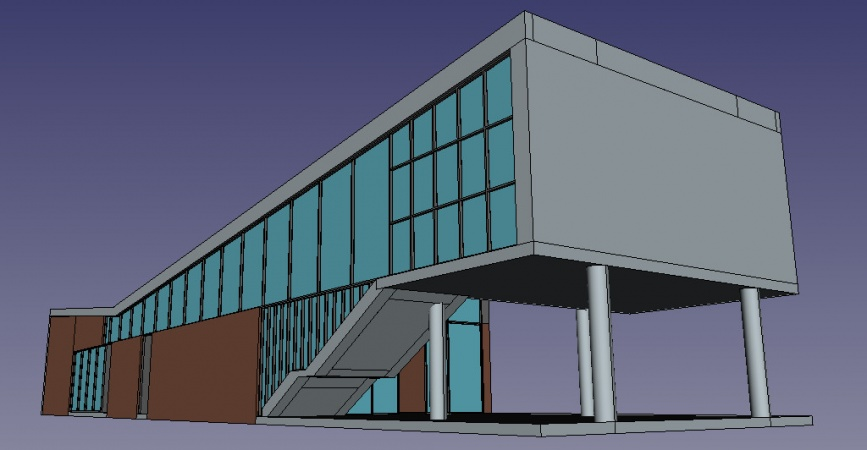
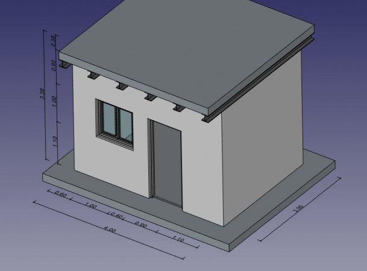
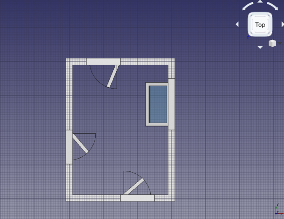

# Tutorials

This page presents a selection of high quality written tutorials. A complete, unsorted list of tutorials can be found in [Category: Tutorials](https://wiki.freecad.org/Category:Tutorials), a complete and sortable one can be found in the [table below](https://wiki.freecad.org/Tutorials#Tutorials_-_Comprehensive_list).

If you'd like to contribute with writing wiki documentation and tutorials, see the general wiki guidelines in [WikiPages](https://wiki.freecad.org/WikiPages), and read the [Tutorial guidelines](https://wiki.freecad.org/Tutorial_guidelines).

Please notice the version of FreeCAD used in the tutorial as some tutorials may use an old version of the program. Although the general modelling process may still work, some tools may have changed.

See also [video tutorials](https://wiki.freecad.org/Video_tutorials) and [books](https://wiki.freecad.org/Books).

## Architecture and BIM

  
[Arch tutorial](https://wiki.freecad.org/Arch_tutorial) (v0.14)  
This is the essential introduction to the Arch Workbench. It is extensive and showcases a typical workflow, from importing plans in DXF format to building the 3D model.

  
[BIM modeling](https://wiki.freecad.org/Manual:BIM_modeling)  
How to model a small house, produce a blueprint with TechDraw, and export to IFC.

  
[Open windows and doors](https://wiki.freecad.org/Tutorial_for_open_windows) (v0.18)  
How to display windows and doors as open, with elevation and plan symbols, and produce a basic floor plan with TechDraw.

